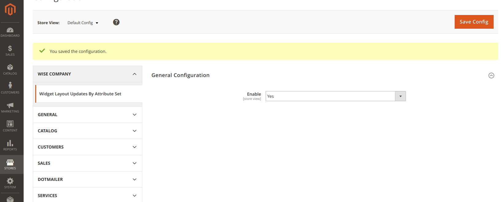
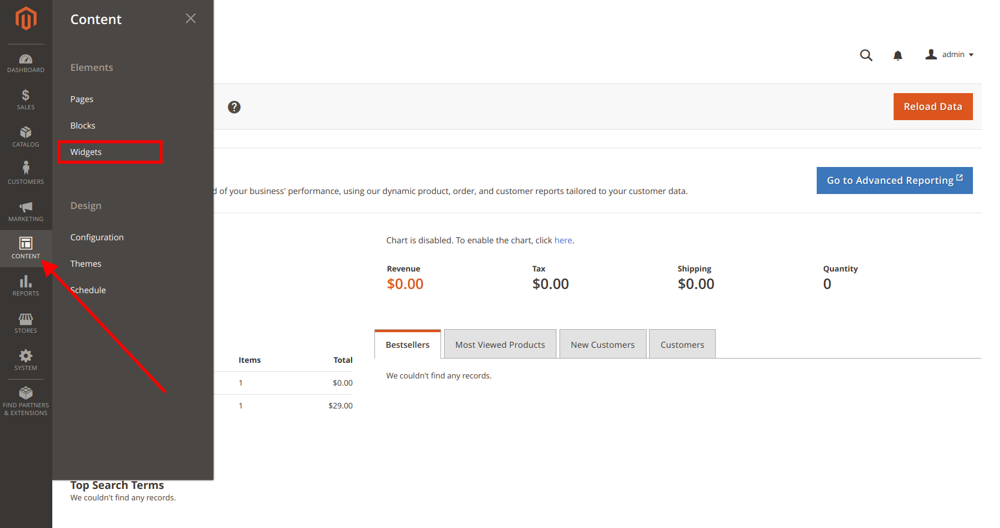
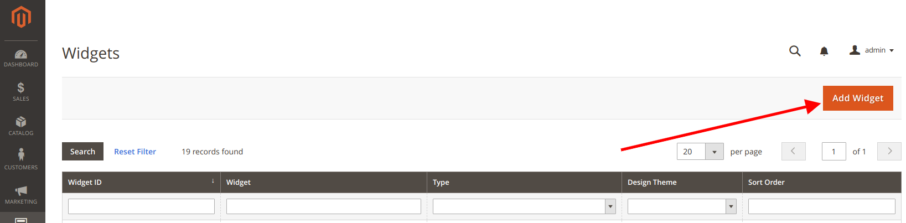
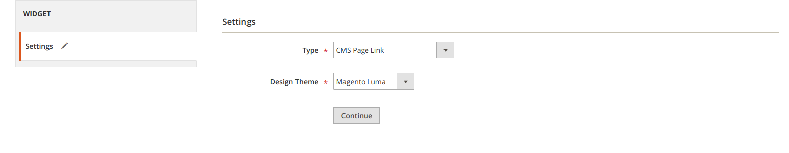
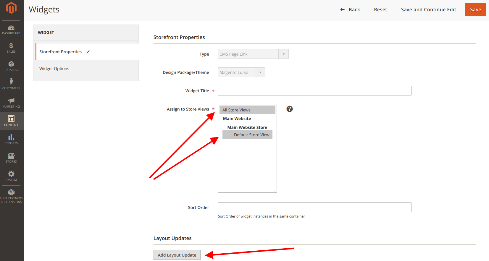
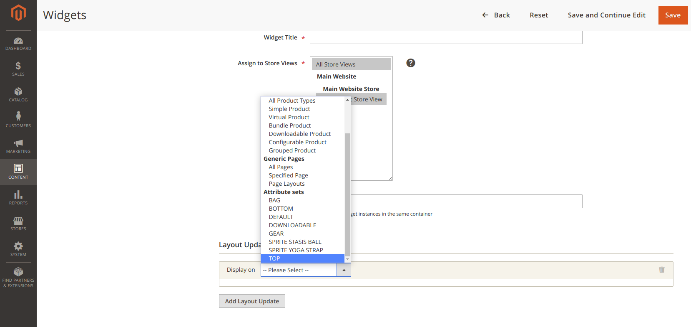

## Magento 2 Extension for update widget layout options by Attribute set 

### ⚠️ Magento versions compatibility for extension: Magento 2.2.x

## Installation guide

#### Install manually

1. Download zip archive from current repository
2. Copy all files and folders from WLUByAttrSet-* folder into 
<your-magento-root-folder>/app/code/Wise/WidgetLayoutUpdatesByAttributeSet
3. To complete the installation, you need to run the following command lines: <br>
````
php bin/magento module:enable Wise_WidgetLayoutUpdatesByAttributeSet
php bin/magento setup:upgrade
php bin/magento setup:di:compile
````
#### Install via composer:
Run the following command in Magento 2 root folder:
````
composer require wise/module-wlubyattrset
php bin/magento module:enable Wise_WidgetLayoutUpdatesByAttributeSet
php bin/magento setup:upgrade
php bin/magento setup:di:compile
````

## Documentation
#### You can enable/disable widgets view in Stores > Configuration > Wise Company > Widget Layout Updates By Attribute Set 


#### Step #1: Go to the widget section for create new widget


#### Step #2: Create new widget


#### Step #3: Set widget type and set your design theme


#### Step #4: Set store view, and add layout update


#### Step #5: After that you can see new "Display on" settings attribute sets option. Choose needed attribute set where on this widget will be used
